[简体中文](./README.md) · [Website](https://k3thrash.lei6393.com) · [GitHub](https://github.com/SuperMarioYL/k3thrash)

<picture>
  <source media="(max-width: 600px) and (prefers-color-scheme: dark)" srcset="./assets/presentation/hero-mobile-dark.svg">
  <source media="(max-width: 600px)" srcset="./assets/presentation/hero-mobile-light.svg">
  <source media="(prefers-color-scheme: dark)" srcset="./assets/presentation/hero-dark.svg">
  
</picture>

# k3thrash

**Make a saved I/O trace easier to interpret.**

k3thrash collects Linux process read counters, correlates available token counts and reports a topology-relative read-rate classification. Saved trace reports also run on macOS.

## Why use it

Throughput alone does not show how much storage traffic accompanies each token. Keeping cumulative bytes and token samples in one trace gives you an inspectable ratio and a report you can share.

- **Keep the samples** — Trace JSON retains counters alongside the topology.
- **Explain the ratio** — The baseline and bytes-per-token appear in the report.
- **Report offline** — Saved traces can be inspected off the Linux rig.

## Architecture

<picture>
  <source media="(max-width: 600px) and (prefers-color-scheme: dark)" srcset="./assets/presentation/architecture-mobile-dark.svg">
  <source media="(max-width: 600px)" srcset="./assets/presentation/architecture-mobile-light.svg">
  <source media="(prefers-color-scheme: dark)" srcset="./assets/presentation/architecture-dark.svg">
  
</picture>

procio samples /proc/PID/io; tokensource tails supported llama.cpp timing lines. trace computes deltas, thrash compares bytes per token against active-expert count times packed-expert bytes, and render produces the verdict and sparkline. The built-in kimi-k3 constants are assumptions of this implementation.

| Component | Responsibility |
| --- | --- |
| `Process counters` | internal/procio |
| `Token timing` | internal/tokensource |
| `Trace deltas` | internal/trace |
| `Baseline verdict` | internal/thrash; internal/topo |
| `ASCII report` | internal/render |

## Install and quickstart

Use the runtime version declared in the repository manifest. The source installation below makes the included example reproducible.

```bash
git clone https://github.com/SuperMarioYL/k3thrash.git
cd k3thrash
go build ./cmd/k3thrash
```

Go 1.24+ and Python 3; render the included six-sample trace without a running model.

```bash
python3 examples/presentation_demo.py
```

## Recorded demo

<picture>
  <source media="(max-width: 600px) and (prefers-color-scheme: dark)" srcset="./assets/presentation/process-mobile-dark.svg">
  <source media="(max-width: 600px)" srcset="./assets/presentation/process-mobile-light.svg">
  <source media="(prefers-color-scheme: dark)" srcset="./assets/presentation/process-dark.svg">
  
</picture>

The synthetic trace is classified as pathological thrash at 3.0x its configured baseline.

```text
=== k3thrash report ===
model: kimi-k3   pid: 4242   topo: kimi-k3 (896 experts / 16 active)
window: 13:45:00 → 13:45:25   samples: 6

verdict:
  re-read rate 3.0× reuse: pathological thrash
  re-read rate 3.00× reuse | reuse ratio 0.33 | classification: pathological thrash
nvme read 77309411328.00 B/token (pathological baseline 25769797776.00 B/token)

re-read-rate sparkline (bytes/token, min-max normalized):
  ▅▅▅▅▅
  min 77309411328 | max 77309411328 B/token across 5 samples

share: paste the block above into your thread / issue.
=== end k3thrash report ===
```

The complete command and output are recorded in [docs/demo-results.json](./docs/demo-results.json). Inputs and reproduction code are included in the repository.


## Usage

Run these commands from the repository root after installation. Replace paths for your own data.

```bash
go run ./cmd/k3thrash report examples/trace.example.json
# Linux only; replace the PID and timing file for your process:
go run ./cmd/k3thrash attach --pid 1234 --expert-topo kimi-k3 --token-source decode.log --interval-ms 100 --out trace.json
go run ./cmd/k3thrash report trace.json
```

## Configuration

attach uses --pid, --token-source (file/FIFO or - for stdin), --out, --interval-ms and --no-verdict. Use a positive interval; the default is 100ms. The built-in registry supports kimi-k3 and its aliases. Ratio <1 is healthy_warmup, 1 to <2 is partial_warm, and >=2 is pathological_thrash; these are diagnostic buckets, not independently calibrated expert-residency measurements.

## Integrations and responsibilities

<picture>
  <source media="(max-width: 600px) and (prefers-color-scheme: dark)" srcset="./assets/presentation/integrations-mobile-dark.svg">
  <source media="(max-width: 600px)" srcset="./assets/presentation/integrations-mobile-light.svg">
  <source media="(prefers-color-scheme: dark)" srcset="./assets/presentation/integrations-dark.svg">
  
</picture>

Choose the input and output route that matches your workflow. The local example below exercises the stated subset.

| Route | Implemented role |
| --- | --- |
| Linux /proc | Process read_bytes counter |
| Timing file / stdin | Supported token count lines |
| Trace JSON | Samples and topology fields |
| Terminal report | Verdict and sparkline |

## Limits and next steps

- The demo input is synthetic and its model/hardware labels are fixture metadata. No throughput or hardware result is measured here.
- Aggregate process read_bytes does not identify an NVMe device, a specific expert or causal cache misses. Classification depends on the built-in topology constants.
- Live attach requires Linux /proc access. Without advancing token counters a per-token ratio is not a reliable measurement; this tool diagnoses rather than prefetches weights.

Per-expert instrumentation, additional topology definitions and cross-node comparisons remain future work.

## License and contributions

See [LICENSE](./LICENSE). When reporting an issue, include a minimal input, the command, and the observed output.
