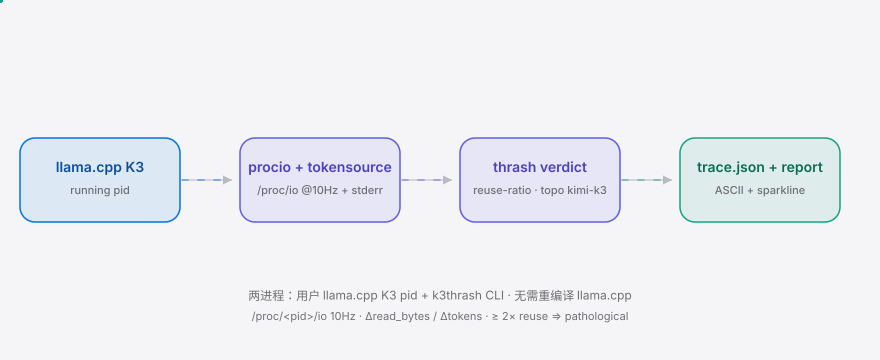
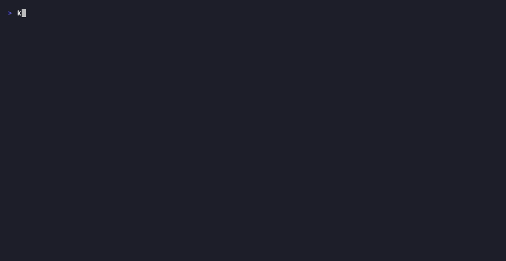

<div align="right"><sub>[<a href="./README.en.md">English</a>] &nbsp;·&nbsp; <b>简体中文</b></sub></div>

<p align="center">
  <picture>
    <source media="(prefers-color-scheme: dark)" srcset="./assets/hero-dark.svg">
    <source media="(prefers-color-scheme: light)" srcset="./assets/hero-light.svg">
    
  </picture>
</p>

<p align="center"><sub>挂到正在运行的 llama.cpp K3 进程上，按 token 给出 NVMe 重读/复用比与一行抖动判定。</sub></p>

<p align="center">
  <a href="./LICENSE"></a>
  <a href="https://github.com/SuperMarioYL/k3thrash/releases"></a>
  
  
  
  
</p>

**Kimi K3 解码 tps 随时间往上漂——是健康的缓存预热，还是 NVMe 专家反复换出的病态抖动？k3thrash 挂上去一行判定。**

<h2> 架构</h2>

<p align="center">
  <picture>
    <source media="(prefers-color-scheme: dark)" srcset="./assets/atlas-dark.svg">
    <source media="(prefers-color-scheme: light)" srcset="./assets/atlas-light.svg">
    
  </picture>
</p>

两个进程：你正在跑的 `llama.cpp` Kimi K3 pid，加上 `k3thrash` CLI。无需重编译 llama.cpp，无需重载模型。`procio` 以 10Hz 采样 `/proc/<pid>/io.read_bytes`，`tokensource` 尾读 llama.cpp stderr 的逐 token 时间，`thrash` 引擎按 kimi-k3 拓扑（896 专家 / 16 激活 / ~1.6GiB 打包专家）算出每 token 的 NVMe 重读率，`render` 渲染可分享的 ASCII 报告 + sparkline。

<h2> 为什么需要</h2>

Kimi K3（Moonshot AI 开源 1.56TB sparse-MoE，896 专家 / 16 激活）在家用 NVMe rig 上只能按需把专家从盘上流式读入——93% 的 checkpoint 是路由专家，专家永远不会全部驻留。这会带来一个反直觉的故障：解码 tps 随时间往上漂，像是「预热」，但你分不清是健康的缓存变热、宿主 page-cache 效应，还是病态的专家反复换出在砸 NVMe 总线。`llama-bench` 在 K3 上直接 crash，就算能跑也只给聚合 tps，结构上拿不出逐 token 的专家驻留归因。k3thrash 就是把这个判定做成一个可粘贴的一行 verdict。

| 维度 | `llama-bench` | `xpref` | **k3thrash** |
|---|---|---|---|
| 逐 token NVMe 重读率 | — | — | ✓ |
| 抖动 verdict（健康/部分/病态） | — | — | ✓ |
| 可分享 ASCII 报告 + sparkline | — | partial | ✓ |
| 在 K3 上不 crash | ✗ | ✓ | ✓ |
| 给出「要不要上 xpref」的判定 | — | — | ✓ |
| 改善吞吐（prefetch） | — | ✓ | ✗（v0.1 只诊断） |

诚实标注：v0.1 是**聚合 NVMe 读取率**粒度（逐 token、跨所有专家求和、无专家身份）。逐专家身份（896 个里哪个 fired）via eBPF/uprobe 是 v0.2 north star，本期显式不做。

<h2> 快速开始</h2>

```bash
go install github.com/SuperMarioYL/k3thrash@latest          # 1. 装好
k3thrash report examples/trace.example.json                 # 2. 看一行 verdict（跨平台）
# Linux K3 rig 上：k3thrash attach --pid $(pgrep -f llama)  # 3. 挂到真实 K3 pid，30s 内出 verdict
```

<details>
<summary>sample output（<code>k3thrash report examples/trace.example.json</code>）</summary>

```
=== k3thrash report ===
model: kimi-k3   pid: 4242   topo: kimi-k3 (896 experts / 16 active)
window: 13:45:00 → 13:45:25   samples: 6

verdict:
  re-read rate 3.0× reuse: pathological thrash
  re-read rate 3.00× reuse | reuse ratio 0.33 | classification: pathological thrash
nvme read 77309411328.00 B/token (pathological baseline 25769797776.00 B/token)

re-read-rate sparkline (bytes/token, min-max normalized):
  ▅▅▅▅▅
  min 77309411328 | max 77309411328 B/token across 5 samples

share: paste the block above into your thread / issue.
=== end k3thrash report ===
```
</details>

<h2> 用法</h2>

**attach — 挂到正在跑的 llama.cpp K3 pid，流式输出 verdict + 写 trace.json（Linux only）**

```bash
# 把 llama.cpp stderr 引到一个 fifo，k3thrash 同时读 token 计数
mkfifo /tmp/k3.fifo
llama-cli -m kimi-k3.gguf ... 2> /tmp/k3.fifo &

k3thrash attach --pid $(pgrep -f llama) --expert-topo kimi-k3 \
  --token-source /tmp/k3.fifo --out trace.json
# Ctrl-C 停止 → 写出 trace.json + 一行最终 verdict
```

**report — 从 trace.json 渲染可分享 ASCII 报告（跨平台，macOS 也能跑）**

```bash
k3thrash report trace.json            # 打印 verdict + sparkline
k3thrash report trace.json > share.txt  # 重定向到文件贴到论坛
```

**version**

```bash
k3thrash --version                    # k3thrash v0.1.0
```

<h2> Demo</h2>

<p align="center"></p>

Demo gif 由 [`docs/demo.tape`](./docs/demo.tape)（vhs 脚本）在 `.github/workflows/demo.yml` 里渲染，手动触发可刷新。提交进仓库的 gif 即真相源。

<h2> 配置</h2>

`k3thrash attach` 关键 flag：

| flag | 类型 | 默认 | 含义 |
|---|---|---|---|
| `--pid` / `-p` | int | （必填） | 要挂载的 llama.cpp K3 进程 pid |
| `--expert-topo` | string | `kimi-k3` | MoE 专家拓扑（v0.1 仅 `kimi-k3`） |
| `--token-source` | string | `""` | llama.cpp stderr token-timing 流的路径（fifo/文件），`-` 表 stdin；留空则只用读取率+topo 基线判 |
| `--out` / `-o` | string | `trace.json` | trace JSON 输出路径 |
| `--interval-ms` | int | `100` | 采样间隔 ms（默认 100 = 10Hz） |
| `--no-verdict` | bool | `false` | 只流式输出 raw read_bytes/s，跳过 verdict 行 |

判定阈值（`internal/thrash/verdict.go`）：重读率 `< 1.0×` → `healthy_warmup`；`1.0–2.0×` → `partial_warm`；`≥ 2.0×` → `pathological_thrash`。

<h2> 付费</h2>

**个人 self-host 永久免费**（本仓库 MIT 开源）。多节点 K3 / 多 MoE rig 调优实验室需要跨节点对比、历史轨迹、阈值告警——这是 post-MVP 的 hosted fleet-dashboard tier（`mvp_plan §6` 显式 out of scope，本仓库不含）。

- 谁先付费：≥2 节点 NVMe rig 的国产 MoE 调优实验室 / 高校 AI infra 组 / 跑 K3 + DeepSeek-V3.x 的 startup。
- 价位（预估）：¥299/rig/月（~$40/rig/mo），按 rig 不按 seat。
- 最小刷卡 demo path：invite-only PoC——lab 上传 3 份多节点 K3 run 的 `trace.json`，看到跨节点重读率对比 + 告警阈值配置页，自己 rig 的病态节点被红框标出的那一刻 = 付费触发点。
- 想要 fleet tier？在 [Discussions](https://github.com/SuperMarioYL/k3thrash/discussions) 留下你的节点数 + 场景，PoC 开放时优先你。

<h2> 路线图</h2>

- [x] **m1** 采样 `/proc/<pid>/io` @10Hz，流式 `read_bytes/s` + 写 `trace.json`
- [x] **m2** 关联 decode token 率，按 kimi-k3 topo 算 reuse-ratio，输出一行 verdict
- [x] **m3** `k3thrash report` 渲染 ASCII 报告 + sparkline；README + demo gif + release CI
- [ ] **v0.2** 逐专家身份信号 via eBPF/uprobe（896 里哪个 fired per token）—— north star
- [ ] 拓扑可插拔：DeepSeek-V3.x / Qwen3-MoE 等 NVMe-demand sparse-MoE
- [ ] hosted fleet-dashboard tier（多节点对比 + 历史轨迹 + 阈值告警，post-MVP 商业 tier）
- [ ] 实时告警 / 通知

<h2> License & Contributing</h2>

MIT，见 [LICENSE](./LICENSE)。Bug / 特性请求请去 [Issues](https://github.com/SuperMarioYL/k3thrash/issues)；PR 欢迎，fork → branch → PR。CN 用户可走 [Gitee 镜像](https://gitee.com/SuperMarioYL/k3thrash)（push 后由 maintainer 同步）。

<p align="center"><sub><a href="./LICENSE">MIT</a> © 2026 SuperMarioYL</sub></p>
